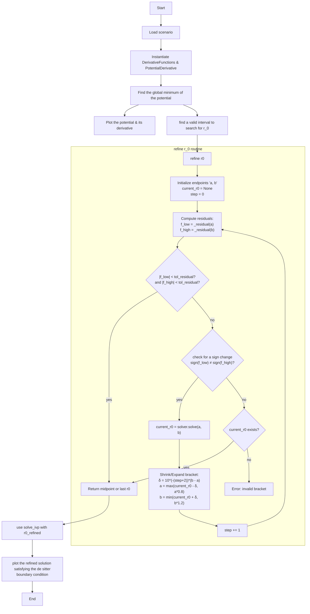

# f(R) Gravity in Static and Spherically Symmetric Spacetimes

A Python program for exploring and testing f(R) modified-gravity models. This program implements:

- **Benchmark Models**  
  – Hu-Sawicki   
  – αL_L_M (Miranda)   
  – λL_L_M (Starobinsky)  
  – An empty scenario directory is left for the user as a template for a new proposed model (make a copy in the same directory as the template and edit the copy)
- **Numerical boundary value problem Solver**  
  – Adapts a custom shooting method via SciPy's solve_ivp  
- **Shooting Method & Bracket Refinement**  
  – Automatically finds an approximate initial value R0 to satisfy de Sitter boundary conditions  
  – Adaptive interval search expansion for R0, with root-finding using Brent’s method  
- **Potential associated to an f(R) model**  
  – Computes V(R) and its derivatives  
  – Locates nontrivial local minima via robust root-finding  
- **Plots**  
  – potential and its derivative  
  – Ricci scalar satisfying the de Sitter boundary condition

---

## Program Flowchart

Below is the full Mermaid flowchart of the program:

---

## License

This project is licensed under the MIT License.  
See the [LICENSE](LICENSE) file for details.